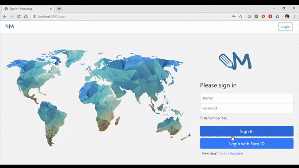

# microblog
MicroBlog web application built to understand Flask framework and implement Face Recognition as the login option.

For Face recognition we using Histogram of Oriented Gradients on Black and White photos. We are breaking the image into small squares of 16x16 pixels each and finding the major direction into which the light gets darker over the face and highlighting it with an arrow. These arrows are called gradients and they show the direction the image is getting darker. To find faces in this HOG image, all we have to do is find the part of our image that looks the most similar to a known HOG pattern that was extracted from a bunch of other training faces.

## Getting Started

These instructions will get you a copy of the project up and running on your local machine for development purposes.

### Prerequisites
What things you need to install the software and how to install them:

```
Microsoft Visual Studio 2015 (or newer) with C/C++ Compiler installed.
Of course Python3 (I used Python3.7.3 x64)
CMake for windows and add it to your system environment variables.
```

### Installing
```
This project is under development and hence a single installer is not available.
You can clone the whole project into your local and start working on the same.
There are mulitple Flask library used, please go through the package installation details. 
If there is any new package added the same will be updated here. 
```
```
Installation:
Just install dlib and face_recognition (not always on newest version):
pip install dlib and then pip install face_recognition.

Manual installation:
pip install flask
pip install flask-wtf
pip install flask-sqlalchemy
pip install flask-migrate
pip install flask-login
pip install flask-uploads
pip install flask-moment
pip install face_recognition
pip install flask-bootstrap
pip install scipy
pip install numpy
pip install opencv-python
or for Machine Learning libraries you can install anaconda. I used conda 4.7.11.
```

## Built With
* Flask and respective Flask libraries for database connection and integration of frontend webpages 
* Face Recognition for generating Face encodings and also for finding similarities.  
* Python 3.7.3



## Authors
* **Akshay Prakash** - *Initial work*

## Acknowledgments
* Miguel Grinberg : https://github.com/miguelgrinberg
* Adam Geitgey : https://medium.com/@ageitgey/machine-learning-is-fun-part-4-modern-face-recognition-with-deep-learning-c3cffc121d78
* Hat tip to anyone whose code was used
* Inspirations
